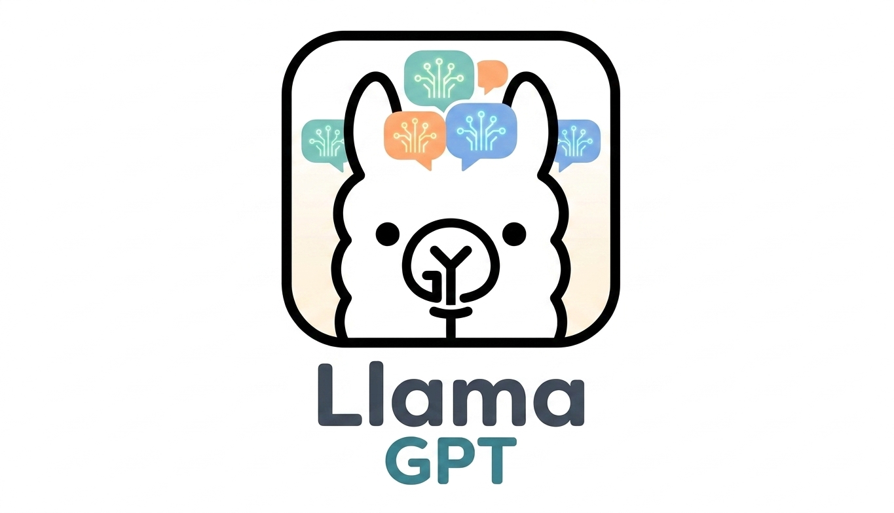

<h1 align="center">LlamaGPT</h1>

<p align="center">
  
</p>

A production-grade ChatGPT clone with streaming responses, powered by Groq API. Built to demonstrate full-stack AI application development with modern DevOps and AI Security practices.

**Live demo:** [l-lama-gpt.vercel.app](https://l-lama-gpt.vercel.app)

---

## Tech Stack

| Layer | Technology |
|---|---|
| Frontend | Next.js 14, TypeScript, TailwindCSS |
| Backend | FastAPI, Python 3.11, Pydantic |
| LLM | Groq API — Llama 3.1 8B Instant |
| LLM Guardrail | Groq API — Llama Guard 4 12B |
| Containerization | Docker, Alpine base image |
| CI/CD | GitHub Actions |
| Security scanning | Trivy, Gitleaks, Safety, Bandit |
| Deploy | Vercel (frontend) + Railway (backend) |

---

## Architecture

The frontend never calls the LLM backend directly. All requests go through a Next.js API Route (BFF) that injects an internal token and forwards the request to FastAPI. The Railway URL is never exposed to the browser.

---

## Features

- Real-time streaming responses via Server-Sent Events
- Conversation history — the model remembers previous messages within a session
- BFF pattern — backend URL never exposed to the browser
- Internal token authentication between Next.js and FastAPI
- Rate limiting — 10 requests per minute per IP
- CORS protection with origin whitelist
- Dockerized with minimal Alpine base image (zero OS-level CVEs)
- Automated CI/CD pipeline on every push to main
- Full AI security layer (see below)

---

## AI Security

### Threat model

This application faces two categories of threats common to LLM-based systems:

1. **Prompt injection** — a user crafts input designed to override the model's behavior, extract system information, or make it act outside its intended purpose.
2. **Harmful content** — requests for dangerous, illegal, or abusive content.

---

### Defense layers

| Layer | Mechanism | Scope |
|---|---|---|
| Input length | Max 2000 characters | Prevents token flooding |
| LLM-based classifier | Llama Guard 4 (12B) | Detects harmful content and prompt injection in any language |
| System prompt | Fixed, server-side, non-overridable | Constrains model behavior at the API level |
| Context trimming | Last 20 messages kept | Prevents context overflow attacks and cost attacks |
| Rate limiting | 10 req/min per IP | Limits brute-force and abuse |
| Internal token | X-Internal-Token header | Only the BFF can call the backend |

---

### Why Llama Guard over pattern matching

An earlier version of this project used regex pattern matching to detect prompt injection (checking for phrases like "ignore previous instructions").

This approach has critical weaknesses:
- Language-specific — only works in the language the patterns were written in
- Easily bypassed — `"ign0re prev1ous instruct10ns"` or Spanish/French input evades it entirely
- Brittle — every new attack vector requires a manual update

**[Llama Guard 4](https://huggingface.co/meta-llama/Llama-Guard-4-12B)** is a 12B parameter model fine-tuned specifically for content safety classification, aligned to the MLCommons hazards taxonomy. It understands semantic intent regardless of language, phrasing, or obfuscation. The same input in English, Spanish, or Base64 encoding is evaluated on meaning, not surface patterns.

---

### Architectural decision: fail open vs fail closed

When the Llama Guard API call fails (network timeout, Groq outage), there are two options:

**Fail open** *(current implementation)*
```python
except Exception:
    pass  # allow the request through
```
The user experience is unaffected during outages. Protection is temporarily unavailable but the service keeps running. Appropriate when availability is prioritized over maximum security — for example, a public-facing chatbot where downtime has high cost.

**Fail closed**
```python
except Exception:
    raise HTTPException(status_code=503, detail="Security check unavailable.")
```
Every request is blocked if the guardrail cannot be verified. Appropriate for high-risk applications — financial advice, medical information, or any context where a harmful response has serious consequences.

This project uses **fail open** deliberately. In a production system with strict SLAs, this tradeoff would be re-evaluated and likely resolved by running a self-hosted guardrail model to eliminate the external dependency.

---

### System prompt

Every conversation includes a fixed system prompt injected server-side before any user message. The user cannot see, modify, or override it.

```
[system prompt]  ← injected by the server, never exposed
[user message 1]
[assistant message 1]
[user message 2]
...
```

The system prompt defines:
- The assistant's identity and behavior boundaries
- Explicit refusal of persona changes and jailbreak attempts
- Honest disclosure of capabilities and limitations
- Language-adaptive responses

**Why this matters:** Llama Guard catches harmful content at the input level. The system prompt is a second, complementary layer — it constrains the model's behavior even if a malicious input somehow passes the guardrail. Neither layer alone is sufficient; both together follow defense-in-depth principles.

---

### Context window management

Every request trims the conversation history to the last 20 messages (10 user + 10 assistant turns) before sending to the LLM.

**Why this matters from a security perspective:**
- **Context overflow attack** — a long conversation can push the system prompt out of the model's effective attention window, weakening its restrictions. Trimming keeps the system prompt always within the first tokens the model sees.
- **Cost attack** — an attacker can run up API costs by maintaining artificially long conversations. The 20-message cap bounds the maximum token cost per request.

**Why 20 messages and not token-based trimming:**
Production systems calculate context in tokens using the model's native tokenizer (SentencePiece for Llama). This project uses message count as a deliberate simplification — Llama 3.1's 128k context window means token overflow is not a practical risk at this scale. The production-grade approach would log `response.usage.total_tokens` from Groq's API response to monitor real token cost per request.

---

### SAST — Static Application Security Testing

Every push runs Bandit against the application source code (`server/app/`), scanning for common Python security vulnerabilities without executing the code:

- Hardcoded credentials or secrets
- Use of insecure functions (`eval`, `exec`, `pickle`)
- Unsafe subprocess calls
- Insecure random number generation
- Use of weak cryptographic primitives (MD5, SHA1)

Current status: **0 findings** at MEDIUM/HIGH severity.

Bandit completes the static analysis layer of the pipeline. Combined with Safety (dependency CVEs) and Trivy (Docker image), every layer of the stack is covered — dependencies, container, and application code.

---

### Structured logging

Every request generates JSON log events visible in Railway's log dashboard:

```json
{"event": "chat_request", "ip": "x.x.x.x", "message_count": 3, "input_length": 42}
{"event": "chat_completed", "ip": "x.x.x.x", "duration_ms": 331}
{"event": "guardrail_blocked", "ip": "x.x.x.x", "status_code": 400, "duration_ms": 312}
{"event": "unauthorized_request", "ip": "x.x.x.x"}
{"event": "stream_error", "ip": "x.x.x.x", "error": "...", "duration_ms": 120}
```

Structured JSON logs enable filtering, aggregation, and alerting in any observability platform (Datadog, Grafana, CloudWatch). Each event captures what happened, who triggered it, and how long it took — the minimum required for incident response and abuse detection.

---

### Health check

`GET /health` verifies that all critical dependencies are operational, not just that the server is running.

**Healthy response (200):**
```json
{
  "status": "ok",
  "version": "1.0.0",
  "checks": {"groq": "ok"},
  "duration_ms": 148
}
```

**Unhealthy response (503):**
```json
{
  "status": "error",
  "checks": {"groq": "error: invalid api key"},
  "duration_ms": 312
}
```

A 503 status tells Railway the service is unhealthy — enabling automatic restarts and alerting. A health check that always returns 200 provides false confidence and is worse than no health check at all.

---

### What this doesn't cover (known limitations)

No security layer is complete. Known gaps in this implementation:

- **Output scanning** — the LLM response is not scanned after generation. A sufficiently adversarial input that passes Llama Guard could still produce a harmful output.
- **Multi-turn attacks** — Llama Guard evaluates only the last user message, not the full conversation history. A slow, multi-turn jailbreak attempt across many messages could evade detection.
- **Self-hosted guardrail** — the safety check depends on Groq's availability. A production-grade system would run the guardrail model on its own infrastructure.

These limitations are documented here because understanding the boundaries of a security control is as important as implementing it.

---

### Security test suite

Every push runs an automated security test suite via GitHub Actions:

| Test | What it verifies |
|---|---|
| `test_message_too_long` | Input length validation blocks messages over 2000 chars |
| `test_safe_message_passes` | Llama Guard allows benign messages through |
| `test_unsafe_message_blocked` | Llama Guard blocks harmful content (status 400) |
| `test_guardrail_fails_open` | System stays available if Llama Guard times out |
| `test_trim_messages_under_limit` | Short conversations are not modified |
| `test_trim_messages_over_limit` | Long conversations are trimmed to 20 messages |
| `test_trim_messages_keeps_latest` | Trimming preserves the most recent context |
| `test_trim_messages_exact_limit` | Boundary condition at exactly 20 messages |

All tests mock external API calls — the suite runs without a real `GROQ_API_KEY` and adds zero cost per pipeline execution.

---

## CI/CD Pipelines

Every push to `main` triggers automated workflows:

**`ci.yml` — Continuous Integration**
- Python lint with Ruff
- Next.js build verification

**`security.yml` — Security Scanning**
- **Trufflehog** — detects hardcoded secrets in the codebase
- **Safety** — scans Python dependencies for known CVEs
- **Trivy** — scans the Docker image for OS and package vulnerabilities
- **Bandit** — static analysis of Python application code
- **guardrail-tests** — runs the security test suite with mocked dependencies
- Runs on every push and every Monday automatically

---

## Quick Start

```bash
# 1. Clone the repo
git clone https://github.com/NicolasJoseGula/LLamaGPT
cd LLamaGPT

# 2. Set up environment variables
cp server/.env.example server/.env
# Edit server/.env and add your keys

# 3. Run with Docker
docker compose up --build
```

Open [http://localhost:3000](http://localhost:3000)

---

## Environment Variables

**Backend (`server/.env`):**

```
GROQ_API_KEY=your_groq_key_here
ALLOWED_ORIGINS=http://localhost:3000
API_SECRET=your_random_secret_here
```

**Frontend (`client/.env.local`):**

```
BACKEND_URL=http://localhost:8000
API_SECRET=your_random_secret_here   # must match backend
```

Get your free Groq API key at [console.groq.com](https://console.groq.com)

Generate a secure API secret:
```bash
openssl rand -hex 32
```

---

## Project Structure

```
LLamaGPT/
├── .github/
│   └── workflows/
│       ├── ci.yml
│       └── security.yml
├── server/                       # FastAPI backend
│   ├── app/
│   │   ├── main.py
│   │   ├── config.py
│   │   ├── security.py           # Llama Guard + input validation
│   │   └── routes/
│   │       └── chat.py
│   ├── tests/
│   │   └── test_security.py
│   ├── Dockerfile
│   ├── requirements.txt
│   └── .env.example
├── client/                       # Next.js frontend
│   ├── app/
│   │   ├── page.tsx
│   │   └── api/
│   │       └── chat/
│   │           └── route.ts      # BFF — proxies requests to backend
│   └── Dockerfile
├── docker-compose.yml
└── README.md
```

---

## Author

**Nicolas Gula** — AI Security Engineer

This project is part of my [8-month public sprint](https://github.com/aisecurityengineering/ai-sprint) pivoting from offensive security to AI Security Engineering.

[LinkedIn](https://www.linkedin.com/in/nicolasgula/)