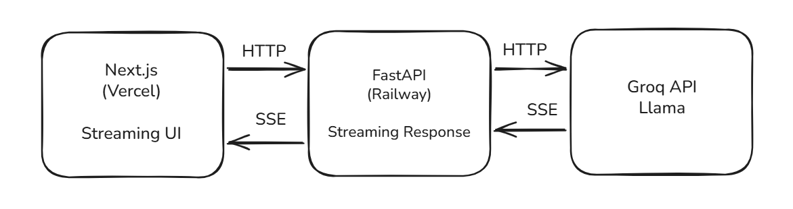

<h1 align="center">LlamaGPT</h1>


A production-grade ChatGPT clone with streaming responses, powered by Groq API. Built to demonstrate full-stack AI application development with modern DevOps practices.

**Live demo:** [l-lama-gpt.vercel.app](https://l-lama-gpt.vercel.app)

---

## Tech Stack

| Layer | Technology |
|---|---|
| Frontend | Next.js 14, TypeScript, TailwindCSS |
| Backend | FastAPI, Python 3.11, Pydantic |
| LLM (cloud) | Groq API — Llama 3.1 8B |
| Containerization | Docker, Alpine base image |
| CI/CD | GitHub Actions |
| Security | Trivy, Gitleaks, Safety |
| Deploy | Vercel (frontend) + Railway (backend) |

---

## Architecture



---

## Features

- Real-time streaming responses (Server-Sent Events)
- Rate limiting with slowapi
- CORS protection
- Dockerized with minimal Alpine base image
- Automated CI/CD pipeline on every push
- Security scanning: dependency vulnerabilities, secret detection, Docker image scanning

---

## Quick Start


```bash
# 1. Clone the repo
git clone https://github.com/NicolasJoseGula/LLamaGPT
cd LLamaGPT

# 2. Set up environment variables
cp server/.env.example server/.env
# Edit server/.env and add your GROQ_API_KEY

# 3. Run with Docker
docker compose up --build
```

Open [http://localhost:3000](http://localhost:3000)

---

## Environment Variables

**Backend (`server/.env`):**

```
GROQ_API_KEY=your_key_here
ALLOWED_ORIGINS=http://localhost:3000
```

Get your free Groq API key at [console.groq.com](https://console.groq.com)

---

## CI/CD Pipelines

Every push to `main` triggers three automated workflows:

**`ci.yml` — Continuous Integration**
- Python lint with Ruff
- Next.js build verification

**`security.yml` — Security Scanning**
- **Gitleaks** — detects hardcoded secrets in the codebase
- **Safety** — scans Python dependencies for known CVEs
- **Trivy** — scans the Docker image for OS and package vulnerabilities
- Runs on every push and every Monday automatically


---

## Project Structure

```
LLamaGPT/
├── .github/
│   └── workflows/
│       ├── ci.yml
│       ├── security.yml
├── server/                  # FastAPI backend
│   ├── app/
│   │   ├── main.py
│   │   ├── config.py
│   │   └── routes/
│   │       └── chat.py
│   ├── Dockerfile
│   └── requirements.txt
├── client/                  # Next.js frontend
│   ├── app/
│   │   └── page.tsx
│   └── Dockerfile
└── docker-compose.yml
```

---

## Author

**Nicolas Gula** — AI Security Engineer

This project is part of my [8-month public sprint](https://github.com/aisecurityengineering/ai-sprint) pivoting from offensive security to AI Security Engineering

[Linkedin](https://www.linkedin.com/in/nicolasgula/)
